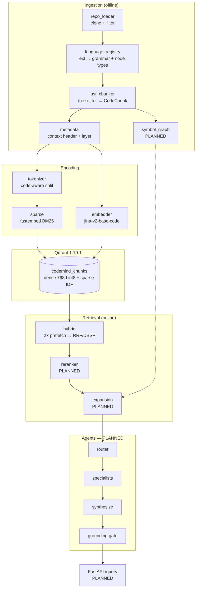
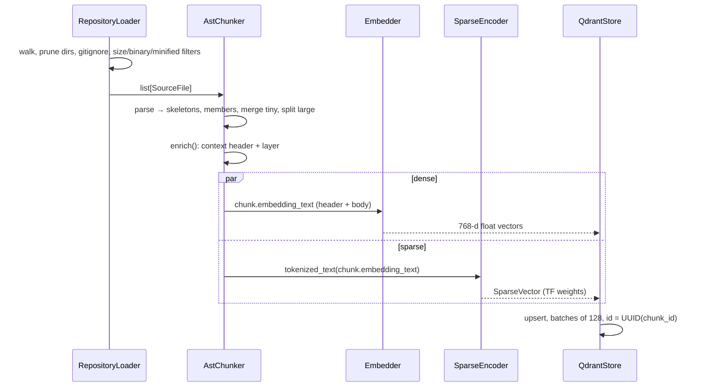

# CodeMind AI — Full Architecture

> **Snapshot:** commit `6646394`, 2026-09-15. Build order: Day 5 of 28 complete.
> 180 tests collected, all passing. Gate 1 (Recall@10 baseline) not yet reached.
>
> Every number in this document was measured on this commit. Components that do
> not exist yet are marked **PLANNED**, and their sections describe the intended
> design rather than behaviour. No metric is quoted for unbuilt code.

---

## Contents

1. [What CodeMind is](#1-what-codemind-is)
2. [Implementation status](#2-implementation-status)
3. [System architecture](#3-system-architecture)
4. [Data flow](#4-data-flow)
5. [Directory structure](#5-directory-structure)
6. [Ingestion components](#6-ingestion-components)
7. [Retrieval components](#7-retrieval-components)
8. [Pipeline execution](#8-pipeline-execution)
9. [Technical choices and trade-offs](#9-technical-choices-and-trade-offs)
10. [Resource budget](#10-resource-budget)
11. [Verification](#11-verification)
12. [Known issues and limitations](#12-known-issues-and-limitations)
13. [Next steps](#13-next-steps)

---

## 1. What CodeMind is

CodeMind ingests a real GitHub repository, indexes it with AST-aware chunking,
retrieves with hybrid search (dense + BM25, fused server-side, then reranked),
and answers technical questions through a LangGraph multi-agent workflow backed
by a QLoRA fine-tuned Qwen2.5-Coder-3B. Every answer must cite `file:line`
evidence that resolves to real code.

The reference question the finished system must answer:

> *"Why does `POST /orders` sometimes return 500?"*
> → trace Controller → Service → Repository → exception, cite files, propose a fix.

The test fixture (`tests/fixtures/sample_repo/`) contains exactly this bug:
`OrderController.createOrder` → `OrderService.placeOrder` →
`PaymentService.processPayment`, which throws an unchecked
`PaymentTimeoutException` that nothing catches.

### Binding constraint

Everything below is shaped by one development machine: **4 GB VRAM, 16 GB RAM,
Windows 11 + WSL2.** The GPU is reserved for the LLM during serving; embedding
and reranking run on CPU; training happens on Kaggle. See
[§10](#10-resource-budget).

---

## 2. Implementation status

| Area | Component | Status | Size |
|---|---|---|---|
| Ingestion | `repo_loader.py` | ✅ Built | 323 lines |
| | `language_registry.py` | ✅ Built | 138 lines |
| | `ast_chunker.py` | ✅ Built (2 known bugs, §12) | 539 lines |
| | `metadata.py` | ✅ Built | 112 lines |
| | `symbol_graph.py` | ⏳ **PLANNED** — stub | 1 line |
| | `pipeline.py` | ⏳ **PLANNED** — stub | 1 line |
| Retrieval | `tokenizer.py` | ✅ Built | 129 lines |
| | `sparse.py` | ✅ Built | 162 lines |
| | `embedder.py` | ✅ Built | 187 lines |
| | `qdrant_store.py` | ✅ Built | 364 lines |
| | `hybrid.py` (RRF + DBSF) | ✅ Built | 161 lines |
| | `schemas.py` | ✅ Built | 139 lines |
| | `reranker.py` | ⏳ **PLANNED** — stub | 1 line |
| | `expansion.py` | ⏳ **PLANNED** — stub | 1 line |
| Core | `config.py`, `types.py`, `exceptions.py` | ✅ Built | 85 / 109 / 35 |
| | `main.py` (FastAPI) | 🟡 Partial — `/health` only, lifespan loads no models | 43 lines |
| | `logging.py`, `observability.py` | ⏳ PLANNED — stubs | — |
| Scripts | `bootstrap_qdrant.py` | ✅ Built | 58 lines |
| | `ingest_repo.py` | ⏳ PLANNED — stub | — |
| Agents, LLM, API v1, storage | all files | ⏳ PLANNED — stubs (Weeks 2–3) | — |
| Evaluation, training | all files | ⏳ PLANNED — stubs (Weeks 1 Day 7, 3, 4) | — |

**Resolution rates.** No resolution-rate metric exists yet: it depends on the
symbol graph, which is unbuilt. [§6.5](#65-symbol-graph--planned) defines what
it should measure so the number means something when it arrives.

---

## 3. System architecture

### 3.1 Layered module structure

The package is split into five layers. An `import-linter` contract in
`pyproject.toml` enforces that each layer may import only from layers below it:

```
codemind.api         HTTP surface, SSE streaming              (PLANNED)
    ↓
codemind.agents      LangGraph StateGraph, nodes, tools       (PLANNED)
    ↓
codemind.retrieval   tokenizer, encoders, Qdrant, fusion      (BUILT, rerank/expansion PLANNED)
    ↓
codemind.ingestion   loader, registry, chunker, graph         (BUILT, graph PLANNED)
    ↓
codemind.core        config, types, exceptions                (BUILT)
```

A second contract forbids `agents`, `api` and `retrieval` from importing
`codemind.llm.judge`, keeping the LLM-as-judge evaluation-only.

### 3.2 Component diagram



### 3.3 Runtime topology

| Process | Runs | Memory owner |
|---|---|---|
| Qdrant container (`qdrant/qdrant:v1.19.1`) | vector + sparse index | capped at 1500 MB, 2 search threads |
| Ollama (Windows host) | Qwen2.5-Coder-3B Q4_K_M | the entire 4 GB GPU |
| FastAPI (uvicorn) | embedder, sparse encoder, reranker, graph | CPU + system RAM |
| `make ingest` (one-shot) | loader, chunker, encoders | may use CUDA — LLM not loaded |

---

## 4. Data flow

### 4.1 Index time (built through upsert; orchestration PLANNED)



Today the stages above are chained only inside tests
(`tests/integration/test_qdrant_store.py`, `test_hybrid.py`). `pipeline.py` and
`scripts/ingest_repo.py` are stubs.

### 4.2 Query time (built through fusion)

```
"why does POST /orders sometimes return 500"
   │
   ├── Embedder.embed_query ─────────────────► dense vector (raw text, no split)
   │                                                           │
   └── SparseEncoder.encode_query                               │
         └── tokenize_query → "why does post orders sometimes 500"
               └── fastembed query_embed ──► sparse vector (all weights 1.0)
                                                               │
            asyncio.gather — both run concurrently in worker threads
                                                               ▼
   Qdrant query_points
     prefetch[0]: using="dense",  limit=PREFETCH_DENSE  (20)
     prefetch[1]: using="sparse", limit=PREFETCH_SPARSE (20)
     query:       FusionQuery(FUSION_METHOD)  rrf | dbsf
     limit:       PREFETCH_DENSE + PREFETCH_SPARSE      (40)
                                                               ▼
   RetrievalResult[ScoredChunk(score = rrf_score, rank = 1..n)]
                                                               ▼
   reranker → top RERANK_TOP_K (5)       PLANNED
   expansion → callers / callees / parent PLANNED
```

Measured on the fixture, RRF, this query returns `placeOrder` and
`createOrder` tied at 0.833, followed by `OrderController` at 0.500: the right
two hops of the bug's call path, before any reranking.

### 4.3 The invariant that crosses both flows

The **same tokenizer function** processes chunk text at index time and question
text at query time. If they ever diverge, sparse recall silently drops toward
zero with no error. That is why tokenization lives in one module with one
public entry point per side, and why `SparseEncoder` is the only caller of it.

---

## 5. Directory structure

```
codemind-ai/
├── CLAUDE.md                     project rules, invariants, build order
├── Makefile                      install / up / ingest / test / lint / eval-*
├── pyproject.toml                deps, ruff, mypy --strict, import-linter contracts
├── .env.example                  every tunable; Settings reads only from here
├── docker/
│   └── docker-compose.yml        qdrant v1.19.1 (1500 MB cap); optional postgres profile
├── configs/
│   └── prompts/*.jinja2          router, code_analyst, dependency_agent, test_agent,
│                                 synthesizer, grounding_verifier       (PLANNED content)
├── scripts/
│   ├── bootstrap_qdrant.py       ✅ idempotent collection creation, --recreate
│   ├── verify_stack_v2.py        ✅ dependency smoke checks (no Qdrant check)
│   ├── status.py                 ✅ progress tracker for `make status`
│   └── ingest_repo.py            ⏳ stub
├── src/codemind/
│   ├── main.py                   🟡 app factory, /health; lifespan TODO
│   ├── core/
│   │   ├── config.py             ✅ pydantic-settings, frozen, get_settings()
│   │   ├── types.py              ✅ Language, Layer, SourceFile, CodeChunk
│   │   ├── exceptions.py         ✅ CodeMindError hierarchy
│   │   ├── logging.py            ⏳
│   │   └── observability.py      ⏳ Langfuse (Day 13)
│   ├── ingestion/
│   │   ├── repo_loader.py        ✅
│   │   ├── language_registry.py  ✅
│   │   ├── ast_chunker.py        ✅
│   │   ├── metadata.py           ✅
│   │   ├── symbol_graph.py       ⏳ Day 6
│   │   └── pipeline.py           ⏳ Day 6
│   ├── retrieval/
│   │   ├── tokenizer.py          ✅
│   │   ├── sparse.py             ✅
│   │   ├── embedder.py           ✅
│   │   ├── qdrant_store.py       ✅
│   │   ├── hybrid.py             ✅
│   │   ├── schemas.py            ✅
│   │   ├── reranker.py           ⏳ Day 6
│   │   └── expansion.py          ⏳ Day 6
│   ├── agents/                   ⏳ state, graph, nodes/*, tools/*   (Week 2)
│   ├── llm/                      ⏳ base (Protocol), ollama, vllm, judge
│   ├── api/                      ⏳ v1: repositories, query (SSE), traces
│   └── storage/                  ⏳ SQLAlchemy models, SQLite checkpointer
├── tests/
│   ├── fixtures/sample_repo/     Java 4-layer bug + Python + negative cases
│   ├── unit/                     tokenizer, sparse, embedder, chunker, loader, registry, schemas
│   └── integration/              qdrant_store (:memory: + live), hybrid (live)
├── evaluation/                   ⏳ retrieval_eval, ragas_eval, model_benchmark
├── training/                     ⏳ dataset/*, train_qlora, merge_and_export
└── .repos/petclinic/             cloned spring-petclinic, used for measurements here
```

---

## 6. Ingestion components

### 6.1 Repository loader — `ingestion/repo_loader.py`

**Job:** turn a repository root into a deterministic, filtered list of
`SourceFile`s.

`clone_repository()` shallow-clones (`depth=1`) into `.repos/` and reuses an
existing clone. `RepositoryLoader` then walks the tree with an explicit stack,
**pruning excluded directories without descending into them**.

Filters, applied in order, each with its own counter in `LoadStats`:

| Filter | Rule | Why |
|---|---|---|
| Excluded directory | 34 names (`node_modules`, `vendor`, `target`, `build`, `dist`, `migrations`, `generated`, …) plus any dot-directory | Build output and vendored code are near-duplicates that crowd real answers out of the top-k |
| Unsupported extension | not in the language registry | Only chunkable languages are indexed |
| Generated pattern | `*.min.js`, `*_pb2.py`, `*.generated.*`, lockfiles, … | Machine-written code |
| `.gitignore` | via `pathspec` (handles both 0.x and 1.x style names) | Respect the repo's own notion of noise |
| Size | > 1 MB | Almost always generated or data |
| Binary | NUL byte in first 8 KB, **or** strict UTF-8 decode fails | NUL alone misses short random blobs |
| Minified | any line > 2,000 chars | Catches minified files without a `.min.` name |

Files are yielded in **sorted order**, so two runs over the same commit produce
identical chunk order and reproducible batched embedding.

**Measured:**

| Repo | Files seen | Selected | Unsupported | Excluded dirs | Generated | Binary |
|---|---|---|---|---|---|---|
| `sample_repo` fixture | 11 | 7 | 2 | 2 | 1 | 1 |
| `spring-petclinic` | 125 | 50 (138 KB) | 75 | 4 | 0 | 0 |

### 6.2 Language registry — `ingestion/language_registry.py`

**Job:** the single source of truth for what counts as a chunk in each language.
The chunker has no per-language branching beyond what the registry declares;
adding a language is adding one `LanguageSpec`.

| Language | Extensions | Chunk nodes | Container nodes | Import nodes |
|---|---|---|---|---|
| Python | `.py .pyi` | `function_definition`, `decorated_definition` | `class_definition` | `import_statement`, `import_from_statement` |
| Java | `.java` | `method_declaration`, `constructor_declaration` | `class_`, `interface_`, `enum_`, `record_declaration` | `import_declaration` |
| TypeScript | `.ts .mts .cts` | `function_declaration`, `method_definition`, `arrow_function`, `function_signature` | `class_declaration`, `interface_declaration`, `type_alias_declaration` | `import_statement` |
| JavaScript | `.js .mjs .cjs .jsx` | `function_declaration`, `method_definition`, `arrow_function` | `class_declaration` | `import_statement` |

It also owns **layer inference** (`infer_layer`): ordered regexes over
`path + symbol_name` that guess `TEST`, `CONTROLLER`, `SERVICE`, `REPOSITORY`,
`MODEL` or `CONFIG`. Test is checked first, so `UserServiceTest.java` is a
test. `UNKNOWN` is a valid answer and preferred to a confident wrong label.

### 6.3 AST chunker — `ingestion/ast_chunker.py` ⭐

**Job:** turn one `SourceFile` into complete, named, line-addressed
`CodeChunk`s.

A 512-token sliding window over Java cuts through methods: the signature lands
in one chunk and the body in another, both retrieve badly, and neither
compiles when shown to the LLM. Chunking on the syntax tree makes every chunk a
syntactic unit with a name, a line range and an enclosing scope, which is also
what makes `file:line` citations possible.

#### Emission strategy

For every **container** (class, interface, …) found in the file:

1. **One skeleton chunk** (`kind="class"`): the declaration, fields and member
   signatures, with every member body replaced by `{ ... }`, capped at 2,000
   chars. It answers structural questions like "what does `OrderRepository`
   extend", which no method chunk mentions.
2. **One chunk per member** (`kind="function"`): the full method or function
   source.
3. **Consecutive tiny members merge** (`kind="members"`): a run of members that
   are each under 140 chars **and** trivial becomes one "accessors" chunk.
   Eight near-identical getters would otherwise compete in ranking and push out
   the method that actually answers the question.
4. **Oversized members split** (`kind="function_part"`): bodies over 4,000
   chars are cut into parts sharing the original context header. See §12 for a
   bug in the split rule.

Then **top-level members** outside any container (module-level Python
functions, exported TS functions) each become a chunk.

#### What "trivial" means

`_is_trivial` returns true only for a member whose body has at most one
statement and whose name is a dunder (`__init__`, `__repr__`, …) or starts with
`get / set / is / has / to`.

**Annotated members are never trivial.** `@PostMapping createOrder()` is short,
but it is an HTTP endpoint, exactly what questions target. Merging it into an
accessors blob would make it unfindable.

#### Tree-walk rules

- `_find` returns **outermost** matches only. A helper nested inside a method
  stays in that method's chunk rather than being duplicated without context.
- When collecting members, a nested container stops the search on that branch;
  its members are collected by its own container pass.
- Python `decorated_definition` is unwrapped to find the real name.
- Java's package comes from `package_declaration`; Python and TS derive a
  module path from the file path.
- Parsers are created lazily per language and cached on the instance.

**Measured:**

| Repo | Files | Chunks | Skeletons | Members | Merged | Split | Parse errors | Lines p50 / p95 / max |
|---|---|---|---|---|---|---|---|---|
| fixture | 7 | 23 | 7 | 15 | 3 → 1 chunk | 0 | 0 | 4 / 20 / 22 |
| petclinic | 50 | 199 | 45 | 148 | 25 → 6 chunks | 0 | 0 | 10 / 100 / 244 |

The petclinic maximum of 244 lines is a skeleton chunk. Skeleton line ranges
span the whole class even though the body is elided.

### 6.4 Metadata and the context header — `ingestion/metadata.py`

**Job:** compose the header prepended to every chunk before embedding (CLAUDE.md
invariant 1), and fill derived fields.

It lives apart from the chunker because the header format is a *retrieval*
decision, not a parsing one. If Gate 1 shows weak recall, this is the first
file to change, and changing it must not require touching AST code.

```
path | package | EnclosingClass | signature | imports: A, B, C
```

A real header from the fixture:

```
src/main/java/com/demo/repository/OrderRepository.java | com.demo.repository | OrderRepository | Order findByCustomerId(Long customerId); | imports: Order, JpaRepository
```

The trailing `;` is real: an interface method has no body node, so
`_signature_of` falls back to the whole first line. That puts a stray token in
the header; it is harmless to BM25 because the tokenizer strips punctuation.

- Signatures are truncated to 200 chars.
- At most 8 imports, each shortened to its symbol
  (`com.demo.repository.OrderRepository` → `OrderRepository`). Full paths waste
  header budget and give BM25 noisy terms to match.
- `enrich()` sets `layer` via `infer_layer` when it is still `UNKNOWN`.

Without the header, a chunk whose body is `return this.repo.findById(id);` is
semantically identical to that line in every repository class ever written.
`test_embed_chunks_uses_the_context_header` asserts that two identical bodies
with different headers produce different vectors.

**Measured layer distribution on petclinic:** test 100, controller 43,
unknown 34, repository 8, model 7, config 7.

### 6.5 Symbol graph — ⏳ PLANNED

**Status:** `symbol_graph.py` is a one-line stub. Nothing below exists yet.

**Intended design (Day 6):**

- A `networkx.DiGraph` whose nodes are symbols (`file::Class.method`) and whose
  edges are `imports`, `calls`, `extends/implements`, `contains`.
- **Import edges** come from the `import_nodes` the registry already declares,
  and `CodeChunk.imports` already carries the raw import statements per chunk.
- **Call edges** come from walking call-expression nodes in each member body and
  resolving the callee name against symbols in scope.
- Persisted to disk alongside the collection so the API loads it once in the
  lifespan.
- Consumed by `retrieval/expansion.py` and `agents/tools/trace_call_path.py`.

**Resolution rate: definition, no number yet.** Static call resolution without
type inference is lossy. `orderRepository.save(order)` resolves only if the
graph knows the type of the field `orderRepository`. The metric to report is:

```
resolution_rate = call sites resolved to a defined in-repo symbol
                  ─────────────────────────────────────────────────
                  call sites whose target is defined in the repo
```

Calls into libraries (`orElseThrow`, `JpaRepository.save`) belong in neither
numerator nor denominator; counting them makes the rate meaninglessly low.
Report it per language, because field-typed Java resolves far better than
duck-typed Python. The fixture's 4-hop bug path is the minimum: all four hops
must resolve or `trace_call_path` cannot pass Gate 2.

---

## 7. Retrieval components

### 7.1 Code-aware tokenizer — `retrieval/tokenizer.py` ⭐

**Job:** turn code or questions into BM25 terms, identically on both sides
(CLAUDE.md invariant 2).

Standard BM25 tokenization sees `getUserById` as one opaque token that no human
query ever matches. The tokenizer:

1. Splits on every non-alphanumeric character: snake_case, kebab-case, dotted
   paths, generics, punctuation.
2. Splits camelCase and PascalCase with acronym-aware rules:
   `HTTPResponseCode` → `http response code`, not `h t t p …`.
3. Lowercases, drops tokens under 2 chars, drops ~70 Java/TS/Python keywords
   (`public`, `return`, `self`, …).

| Input | Output |
|---|---|
| `getUserById` | `get user by id` |
| `PaymentTimeoutException` | `payment timeout exception` |
| `find_by_customer_id` | `find by customer id` |
| `com.demo.repository.OrderRepository` | `com demo repository order repository` |

`tokenize_query` is `lru_cache`d and deliberately applies the **same stopword
policy** as the index side. BM25 cannot represent negation, so keeping `not` in
queries could only match index entries that no longer exist.

**It does not stem.** Probed directly: fastembed's `Qdrant/bm25` gives `order`
and `orders` identical index sets, and it also drops English stopwords (`by`).
Stemming here too would stem twice. `test_this_module_splits_but_does_not_stem`
pins this.

### 7.2 Sparse BM25 encoder — `retrieval/sparse.py`

**Job:** produce Qdrant `SparseVector`s from tokenized text.

- Wraps `fastembed.SparseTextEmbedding(SPARSE_MODEL)`, loaded once at
  construction. `get_sparse_encoder()` is an `lru_cache` singleton for scripts;
  the API will inject a lifespan-owned instance.
- `cuda=False` is passed explicitly, because fastembed's default is `AUTO`.

**Documents and queries encode differently, on purpose.** BM25 is asymmetric:
term-frequency saturation belongs to the document, and the query contributes
each term once.

| Call | Method | Measured values for "order service find by customer id find find" |
|---|---|---|
| `encode_documents` | `embed()` | `[1.661, 1.661, 1.985, 1.661, 1.661]` (repeated `find` weighted up) |
| `encode_query` | `query_embed()` | `[1.0, 1.0, 1.0, 1.0, 1.0]` |

Using `embed()` for queries would double-count repeated words.

**The IDF half lives in Qdrant**, not here; see §7.4.

Edge cases, all tested:
- A punctuation-only chunk yields an **empty vector but keeps its slot**. The
  store zips vectors to chunks by position, so dropping one would misalign
  every later vector.
- An all-stopword query (`public static void return`) returns an empty vector
  and logs a warning instead of raising.
- numpy scalars are converted to Python `int` / `float`, because Qdrant's strict
  Pydantic models reject `np.int32`.

### 7.3 Dense embedder — `retrieval/embedder.py`

**Job:** 768-d semantic vectors for chunks and queries.

- Model: `jinaai/jina-embeddings-v2-base-code` (161M params, ~640 MB ONNX)
  through fastembed.
- **Device comes from `EMBEDDING_DEVICE`**, never a hardcoded `.cuda()`: `cpu`
  while serving, `cuda` during `make ingest`. Passed explicitly because
  fastembed's `AUTO` would take a visible GPU the LLM needs.
- **Fails at load on a dimension mismatch.** One probe forward pass compares the
  output width to `EMBEDDING_DIM`. Otherwise a model swap would surface as a
  Qdrant upsert rejection an hour into an ingest.
- `embed_chunks` is the supported entry point and **always embeds
  `CodeChunk.embedding_text`** (header + body), never `.body`.
- Queries are embedded raw: no tokenizer, no instruction prefix. The jina v2
  code model is trained symmetrically on NL/code pairs, and splitting
  identifiers would remove signal it can use.
- Batch size `EMBEDDING_BATCH_SIZE=32`, kept small for peak RSS on CPU.

Semantic sanity is tested: "how are payment timeouts handled" is closer to
`class PaymentTimeoutException` than to a CSV parser.

### 7.4 Qdrant store — `retrieval/qdrant_store.py`

**Job:** own the collection schema and the chunk ⇄ point mapping. Storage only;
search lives in `hybrid.py`.

#### Collection schema

| Element | Configuration | Reason |
|---|---|---|
| Named vector `dense` | 768-d, `COSINE`, `on_disk=True` | originals mmapped, not in RSS |
| Quantization | int8 scalar, `quantile=0.99`, `always_ram=True` | 4× smaller copy resident, rescoring against disk originals; the quantile clips outlier dimensions |
| Named vector `sparse` | index `on_disk=True`, **`modifier=IDF`** | fastembed supplies TF; Qdrant computes IDF from corpus statistics |
| Payload | `on_disk_payload=True` | payloads carry full bodies, the largest data here |
| Payload indexes | `file_path` KEYWORD, `language` KEYWORD | exact-match filters; a TEXT index would match `OrderService.java` for the term `order` |

**Why IDF is not optional:** without the modifier Qdrant treats every term as
equally rare, so a query containing the ubiquitous `get` is dominated by it.
The symptom is poor, not zero, sparse recall, which makes it easy to miss. The
integration test asserts the modifier is set.

#### Idempotency and guards

`ensure_collection(recreate=False)`:
- creates the collection plus indexes if absent, and returns `True`;
- if present, **verifies** named vectors exist and the dense size equals
  `EMBEDDING_DIM`, raising `RetrievalError` otherwise. It never silently reuses
  an incompatible collection;
- re-applies payload indexes, which Qdrant treats as a no-op.

#### Point identity

`chunk_id` is a 16-byte blake2b hash of `path : symbol : start_line : body`.
Sixteen bytes is exactly a UUID's width, so the point ID is that hash
reformatted as a UUID. Re-upserting an unchanged chunk overwrites itself, which
the planned resume path depends on.

`CodeChunk.point_uuid` (added in `6646394`) produces the same string as the
store's `point_id_for()`; this was verified. The store has not been switched to
the property yet.

#### Writing and reading

- `upsert_chunks(chunks, dense, sparse)` raises on any length mismatch rather
  than truncating, then upserts in batches of `QDRANT_UPSERT_BATCH` (128) with
  `wait=True`.
- `delete_by_file(path)` removes all chunks from one file, the unit re-ingestion
  replaces.
- `payload_of` / `chunk_from_payload` round-trip every `CodeChunk` field. An
  unknown `layer` degrades to `UNKNOWN`; an unknown `language` is fatal.

### 7.5 Hybrid search and fusion — `retrieval/hybrid.py` ⭐

**Job:** one Query API round trip that runs both branches and fuses them
server-side.

```python
query_points(
    prefetch=[
        Prefetch(query=dense_vec,  using="dense",  limit=PREFETCH_DENSE,  filter=f),
        Prefetch(query=sparse_vec, using="sparse", limit=PREFETCH_SPARSE, filter=f),
    ],
    query=FusionQuery(fusion=FUSION_METHOD),        # rrf (default) | dbsf
    limit=PREFETCH_DENSE + PREFETCH_SPARSE,
)
```

- Both encoders run concurrently with `asyncio.gather`, each in a worker thread.
- An optional `models.Filter` is applied **inside both prefetches**, so ranking
  happens within the filtered set instead of discarding results after fusion.
- An empty sparse vector (all-stopword query) is accepted by Qdrant; the sparse
  branch contributes nothing and results degrade to dense-only. Verified live.
- Every returned `ScoredChunk` has `score == rrf_score`, a 1-based `rank`, and
  `source=HYBRID`. `dense_score` and `sparse_score` stay `None`, because a fused
  query does not report per-branch scores and guessing them would corrupt the
  ablation.
- Empty queries raise `RetrievalError`, as do Qdrant transport errors.

#### RRF versus DBSF

| | RRF (Reciprocal Rank Fusion) | DBSF (Distribution-Based Score Fusion) |
|---|---|---|
| Combines | **ranks** | **scores**, normalized per branch (mean ± 3σ), then summed |
| Strength | scale-free; cosine in [-1, 1] and unbounded BM25 need no calibration | keeps how confident each branch was |
| Weakness | discards the margin: a runaway winner in one branch counts the same as a narrow one | sensitive to score distribution; a flat branch contributes noise |

**Measured on the fixture, live Qdrant.** Query `find by customer id`:

| Branch | #1 | #2 | #3 | #4 |
|---|---|---|---|---|
| Dense | `find_by_id` 0.481 | `get_user_by_id` 0.470 | `findById` 0.463 | `findByCustomerId` 0.431 |
| Sparse | **`findByCustomerId` 8.815** | `findById` 3.434 | `find_by_id` 3.338 | `get_user_by_id` 2.992 |
| **RRF** | `find_by_id` 0.750 | `findByCustomerId` 0.700 | `findById` 0.583 | `get_user_by_id` 0.533 |
| **DBSF** | **`findByCustomerId` 1.729** | `find_by_id` 1.375 | `findById` 1.356 | `get_user_by_id` 1.332 |

The dense scores are nearly flat, while sparse is 2.6× more confident in the
right answer. RRF sees only ranks (dense 1 + sparse 3 beats dense 4 + sparse 1)
and loses that margin; DBSF keeps it.

On the exact-name queries (`findByCustomerId`, `placeOrder`, `processPayment`)
both methods put the target at rank 1. **This is one fixture query, not
evidence.** The default stays `rrf` until the Day 7 goldset ablation compares
both.

### 7.6 Result types — `retrieval/schemas.py`

One shape flows through every retrieval stage, so a stage can be added or
ablated without changing what the next one reads.

- **`ScoredChunk`**: `chunk`, `score` (latest stage), `source`
  (`DENSE / SPARSE / HYBRID / EXPANDED`), `dense_score`, `sparse_score`,
  `rrf_score`, `rerank_score`, `rank`, `citation`.
  `with_rerank_score()` returns a **copy** that preserves the fusion score, so an
  ablation can compare hybrid against hybrid+rerank on the same set.
- **`RetrievalResult`**: `query`, `chunks`, candidate counts, `reranked` /
  `expanded` flags, `retrieval_ms` / `rerank_ms`, plus helpers `citations`,
  `file_paths` (deduplicated, in rank order: the unit Recall@k scores against),
  `top(k)`, `by_layer`, `by_language`.

The timing fields exist but are **not populated**. Per CLAUDE.md invariant 6,
latency comes from Langfuse spans (Day 13), not ad-hoc `perf_counter` calls.

### 7.7 Cross-encoder reranker — ⏳ PLANNED

**Status:** `reranker.py` is a one-line stub.

**Intended design (Day 6):**

- `sentence_transformers.CrossEncoder("BAAI/bge-reranker-base")` (278M) on
  **CPU**, loaded once in the FastAPI lifespan.
- Input: the ≤ 40 fused candidates. Output: top `RERANK_TOP_K` (5) via
  `ScoredChunk.with_rerank_score`, keeping `rrf_score`.
- Scores `(query, chunk.embedding_text)` pairs in one batch inside
  `asyncio.to_thread`. Cross-encoder inference is the expected latency
  bottleneck, so candidates stay capped at 40 and the model stays warm.
- `bge-reranker-v2-m3` only for evaluation runs on rented GPU.

**Why a cross-encoder after fusion:** bi-encoders and BM25 score query and chunk
independently; a cross-encoder reads them jointly, so it can recover cases like
the RRF miss in §7.5 on content. `test_spaced_query_finds_camel_case_method`
currently asserts top-2 and should tighten to rank 1 once the reranker exists.

### 7.8 Graph expansion — ⏳ PLANNED

**Status:** `expansion.py` is a one-line stub and depends on the unbuilt symbol
graph.

**Intended design (Day 6):** for each reranked hit, pull the direct callers,
callees and parent-class skeleton from the symbol graph and append them as
`ScoredChunk(source=EXPANDED)`. That turns "the method that throws" into "the
method that throws plus the controller that calls it", which is what
call-path questions need. Third on the cut list if the schedule slips.

---

## 8. Pipeline execution

### 8.1 What runs today

| Command | Does | Status |
|---|---|---|
| `make up` | starts Qdrant v1.19.1 | ✅ |
| `uv run python scripts/bootstrap_qdrant.py [--recreate]` | creates the collection and indexes, prints config and point count; non-zero exit on connection or schema errors | ✅ verified live: first run creates, second run reports "already exists" |
| `make test` | 180 tests; live-Qdrant tests skip if no server | ✅ |
| `make lint` | ruff check + format, mypy --strict, import-linter | ✅ clean |
| `make dev` | uvicorn on :8000, `/health` only | 🟡 |
| `make ingest REPO=…` | runs `scripts/ingest_repo.py` with `EMBEDDING_DEVICE=cuda` | ⏳ script is a stub |

End-to-end ingestion (load → chunk → encode → upsert → query) currently runs
only inside the integration tests.

### 8.2 Intended ingest pipeline — ⏳ PLANNED (`pipeline.py`, `ingest_repo.py`)

```
clone_repository(url, .repos/<name>)
  → RepositoryLoader.iter_files()                       streaming, sorted
  → AstChunker.chunk()               in a thread pool   CPU-bound parsing
  → QdrantStore.ensure_collection()
  → for each batch of chunks:
        skip IDs already present                         resume
        Embedder.embed_chunks + SparseEncoder.encode_documents   gathered
        QdrantStore.upsert_chunks
  → symbol_graph.build(chunks) → persist
  → report: files, chunks, wall time, collection size
```

Resume relies on content-addressed IDs. Because `start_line` is part of the
hash, a changed file should be re-ingested with `delete_by_file` first, or
orphaned points from shifted functions keep matching queries (§12).

### 8.3 Intended serving lifecycle — ⏳ PLANNED

`main.py`'s lifespan will construct `Embedder`, `SparseEncoder`, the reranker,
`QdrantStore` and the symbol graph once, attach them to `app.state`, and close
the Qdrant client on shutdown. Today it only stores settings.

---

## 9. Technical choices and trade-offs

### 9.1 tree-sitter for chunking

**Chosen over:** fixed-size token windows, regex splitting, language servers.

| For | Against |
|---|---|
| Error-tolerant incremental parser: a file with a syntax error still yields a tree | Grammar node names differ per language, so each language needs a hand-written `LanguageSpec` |
| One API across Python, Java and TS via `tree-sitter-language-pack` | Syntax only, no types: cannot resolve `repo.save()` to a class (limits the symbol graph) |
| Chunks align to functions, so citations have real line ranges | Anonymous and assigned functions (TS arrows) need explicit handling; currently mishandled (§12) |
| Fast, native, no project build required | A language server would give types but needs a full build per repo and far more RAM |

### 9.2 Qdrant with named dense + sparse vectors

**Chosen over:** separate FAISS + BM25 index, Elasticsearch/OpenSearch,
pgvector, Chroma.

| For | Against |
|---|---|
| Dense and sparse on **one point**, so fusion is server-side in one round trip | Local `:memory:` mode ignores payload indexes, so index tests need a live server |
| Built-in IDF modifier, RRF and DBSF: no client-side fusion code | Client and server minor versions must stay within 1 (hit at 1.12 vs 1.19) |
| int8 quantization + on-disk vectors + on-disk payload fit the 16 GB box | Per-branch scores are not returned by a fused query, so the ablation needs separate runs |
| Payload filters applied inside prefetch, not post-hoc | One more container to run |

Elasticsearch and Postgres are excluded by CLAUDE.md on RAM grounds. The
compose file does keep an **opt-in** postgres profile, which conflicts with that
rule even though it is off by default.

### 9.3 fastembed (ONNX) for dense and sparse encoding

**Chosen over:** `sentence-transformers` / PyTorch for the embedder.

| For | Against |
|---|---|
| ONNX runtime is lighter than PyTorch for CPU inference | Only models in fastembed's catalogue (jina-v2-base-code is in it) |
| The same library supplies `Qdrant/bm25` with doc/query-asymmetric weighting | Its `cuda=AUTO` default silently grabs a visible GPU; must be overridden |
| One model cache and one API for both branches | Hidden preprocessing (stemming, stopwords) must be probed, not assumed |

### 9.4 Hybrid retrieval with rank or score fusion

Dense alone misses exact identifiers; BM25 alone misses paraphrase. Fusion is
configurable (`FUSION_METHOD`) because the right choice is empirical: RRF is
calibration-free, while DBSF keeps confidence margins (§7.5). The Day 7
ablation is designed to report both as separate rows: dense-only, sparse-only,
hybrid(RRF), hybrid(DBSF), +rerank, +expansion.

### 9.5 Cross-encoder reranking — PLANNED

**`bge-reranker-base` (278M) on CPU, chosen over** `bge-reranker-v2-m3` (568M)
and LLM-based reranking.

| For | Against |
|---|---|
| Joint query–chunk attention fixes fusion's rank-only mistakes | Cost grows linearly with candidates, so the cap of 40 is a recall ceiling |
| CPU-only: keeps the GPU for the LLM | Expected to be the slowest retrieval stage; must batch and stay warm |
| v2-m3 is stronger but roughly twice the size | Base model accuracy on code questions is unmeasured until Gate 1 |

### 9.6 NetworkX call graph — PLANNED

**Chosen over:** Neo4j, storing edges in SQLite, re-deriving calls at query
time.

| For | Against |
|---|---|
| In-process, zero infrastructure, fits the RAM budget | Entire graph held in memory; fine at repo scale, not at monorepo scale |
| Rich traversal (ancestors, shortest paths) for `trace_call_path` | Pure Python: slow to build for very large repos |
| Trivial to persist and load once in the lifespan | Call edges from syntax alone are lossy; resolution rate must be measured (§6.5) |

A graph database would add a service and RAM for traversals that are 1–4 hops
deep.

### 9.7 asyncio with worker threads for CPU-bound work

**Pattern:** every encoder exposes a blocking `*_sync` method and an `async`
wrapper using `asyncio.to_thread`. Hybrid search gathers dense and sparse
encoding concurrently.

| For | Against |
|---|---|
| The event loop never blocks on inference (CLAUDE.md invariant 7) | Default thread pool size is shared and unbounded in intent; no explicit concurrency cap yet |
| Real parallelism when the native library releases the GIL during inference, as ONNX Runtime does | Pure-Python parts (tokenizing, numpy→list conversion) still contend for the GIL |
| `*_sync` variants keep scripts and tests simple | Two surfaces per method to keep in sync (tests assert async == sync) |
| No multiprocessing: models load once, no per-process RAM copies | tree-sitter parsing is not wrapped in a thread yet; the pipeline must do it |

### 9.8 Configuration, types and errors

- **pydantic-settings, frozen**, read only through `get_settings()`. Every
  tunable (`PREFETCH_*`, `FUSION_METHOD`, batch sizes, devices) comes from
  `.env`; no `top_k` is hardcoded.
- **Plain dataclasses** (`slots=True`) for `CodeChunk` and `ScoredChunk`: they
  are created in hot loops and never cross HTTP. API models will be Pydantic.
- **A `CodeMindError` hierarchy**: retrieval raises `RetrievalError`, ingestion
  `IngestionError` / `ChunkingError`.

---

## 10. Resource budget

| Resource | Budget | Allocation |
|---|---|---|
| GPU 4 GB | Qwen2.5-Coder-3B Q4_K_M (Ollama) | nothing else while serving; embedder only during ingest |
| System RAM 16 GB | Qdrant ≤ 1.5 GB (compose limit) | int8 vectors resident; float32 and payloads on disk |
| | Embedder ~640 MB model | CPU, batch 32 |
| | Reranker 278M (planned) | CPU, ≤ 40 pairs per query |
| | WSL2, IDE, OS | the remainder |
| Training | Kaggle 2× T4 16 GB, 30 h/week | local runs are only 0.5B smoke tests |

**Rough vector memory** (768-d): float32 costs ~3 KB per vector and int8 ~0.77
KB. At 100k chunks that is ~300 MB on disk versus ~77 MB resident.

---

## 11. Verification

### 11.1 Test inventory — 180 tests

| File | Tests | Covers |
|---|---|---|
| `unit/test_tokenizer.py` | 39 | splitting rules, stopwords, index/query symmetry, no stemming |
| `unit/test_language_registry.py` | 26 | extension mapping, node types, layer inference |
| `integration/test_qdrant_store.py` | 22 | schema (IDF, int8, on_disk), idempotency, dim guard, batching, payload round-trip, fixture ingest, live payload indexes |
| `unit/test_ast_chunker.py` | 21 | no function body split, skeletons, merging, annotations, headers |
| `integration/test_hybrid.py` | 18 | exact name at rank 1, fusion score per chunk, RRF vs DBSF, settings-driven limits, filters, stopword and empty queries |
| `unit/test_repo_loader.py` | 16 | file count on fixture, every filter |
| `unit/test_sparse.py` | 14 | doc/query asymmetry, tokenizer applied, empty-vector alignment |
| `unit/test_embedder.py` | 12 | header changes the vector, dim guard, device, async == sync |
| `unit/test_retrieval_schemas.py` | 11 | rerank keeps fusion score, file dedup, citations |
| `test_smoke.py` | 1 | `GET /health` returns 200 `{"status": "ok"}` |

Tests that load models are marked `slow`; live-Qdrant tests skip when no
server is reachable and write only to throwaway collections.

### 11.2 Gates

| Gate | Requirement | Status |
|---|---|---|
| Ingestion | chunk boundaries align with functions on the fixture | ✅ tested, but the check exempts split parts, which is where the bug in §12 hides |
| Day 5 sanity | exact method name at rank 1 | ✅ `findByCustomerId`, `placeOrder`, `processPayment` |
| **Gate 1** | Recall@10 exists on a 30-question goldset; hybrid+rerank beats dense-only | ❌ goldset, eval script and reranker not built |
| Gates 2–4 | agents, fine-tuning, packaging | ❌ not started |

---

## 12. Known issues and limitations

Each item below was confirmed by running code on this commit.

### Bugs

1. **Oversized functions can split mid-expression.** `_split_oversized` cuts on a
   character budget at any line not starting with `)` or `}`. Its docstring
   says "on blank lines"; the Day 3 rule says "never mid-expression". Probe:
   a 246-line Java method split into 3 parts, and part 1 ends *inside* the
   argument list of `service.call(` (`"argument_value_number_027",`), with
   unbalanced parentheses in parts 1 and 2. The fixture has no function over
   4,000 chars and the boundary test exempts `function_part`, so nothing caught
   it. Fix direction: split between top-level statement nodes of the body using
   the tree, not lines.
2. **TypeScript arrow functions are mishandled.** Probe on a 5-line routes file:
   - `export const createOrder = (input: Order) => {...}` produces **no chunk**,
     because the name lives on the parent `variable_declarator` and the arrow
     node has none.
   - `app.get("/orders", (req, res) => {...})` produces **no chunk**, so Express
     handlers are unindexed.
   - `router.post("/pay", async req => {...})` is emitted under the name
     **`req`**: the name fallback picks up the single parameter's `identifier`.

   Only the plain `function placeOrder` is chunked correctly. Fix direction:
   take the name from the enclosing `variable_declarator` or `pair`, and treat
   anonymous callbacks as part of the enclosing call's chunk.

### Rule violations and inconsistencies

3. **`except Exception` in `AstChunker.chunk`** (line 89) contradicts CLAUDE.md's
   "no bare `except Exception`". It re-raises as `ChunkingError`, so it passes
   ruff's BLE001, but the project rule is stricter.
4. **Two UUID implementations.** `CodeChunk.point_uuid` and `point_id_for()`
   produce identical strings (verified). The store should use the property and
   drop the duplicate.
5. **The compose file ships an opt-in postgres service**, which CLAUDE.md rules
   out on RAM grounds.
6. **`verify_stack_v2.py` has no Qdrant check**, so it did not catch the earlier
   1.12 vs 1.19 version skew.
7. **The FastAPI lifespan loads no models.** Encoders currently come from
   `lru_cache` singletons, which is fine for scripts but not the planned
   lifespan ownership.

### Design limitations

8. **Chunk IDs include `start_line`.** Adding one line above a function changes
   its ID. Re-ingestion without `delete_by_file` leaves orphan points citing
   lines that moved.
9. **Skeleton chunks span the whole class range** (up to 244 lines on
   petclinic) even though the body is elided, so a skeleton citation points at
   the class start, not a specific member.
10. **RRF discards score margins** (§7.5). This is by design; DBSF and the
    planned reranker are the mitigations, and neither is validated beyond the
    fixture.
11. **Layer inference is path-regex based.** On petclinic, 34 of 199 chunks are
    `UNKNOWN`. It is a hint and filter, never ground truth.
12. **Excluded directory names are broad.** `migrations`, `bin`, `out` and `gen`
    are skipped wholesale; a repo with real source under those names loses it.
13. **Stopword loss.** Tokenizer keywords plus fastembed's English stopwords can
    empty a query or a chunk. Handled without errors, but those items become
    dense-only.
14. **No latency or throughput numbers exist yet.** They wait on Langfuse
    (Day 13).

---

## 13. Next steps

In build order:

1. **Fix the two chunker bugs** (§12.1, §12.2), with tests: a >4,000-char
   function containing a multi-line call, and a TS file with assigned and
   anonymous arrows. Ingestion correctness is a precondition for any Recall
   number meaning anything.
2. Switch `qdrant_store.py` to `CodeChunk.point_uuid`.
3. **Day 6:** `reranker.py` → `symbol_graph.py` (report resolution rate per
   language) → `expansion.py` → `pipeline.py` + `ingest_repo.py`; ingest
   petclinic and record files, chunks, wall time and collection size.
4. **Day 7 / Gate 1:** 30-question goldset, `retrieval_eval.py`, ablation rows
   dense / sparse / hybrid(RRF) / hybrid(DBSF) / +rerank, reporting Recall@5,
   Recall@10, MRR and nDCG@10 in `evaluation/reports/week1_retrieval.md`. Pick
   the default `FUSION_METHOD` from that table.
5. Wire models into the FastAPI lifespan.
